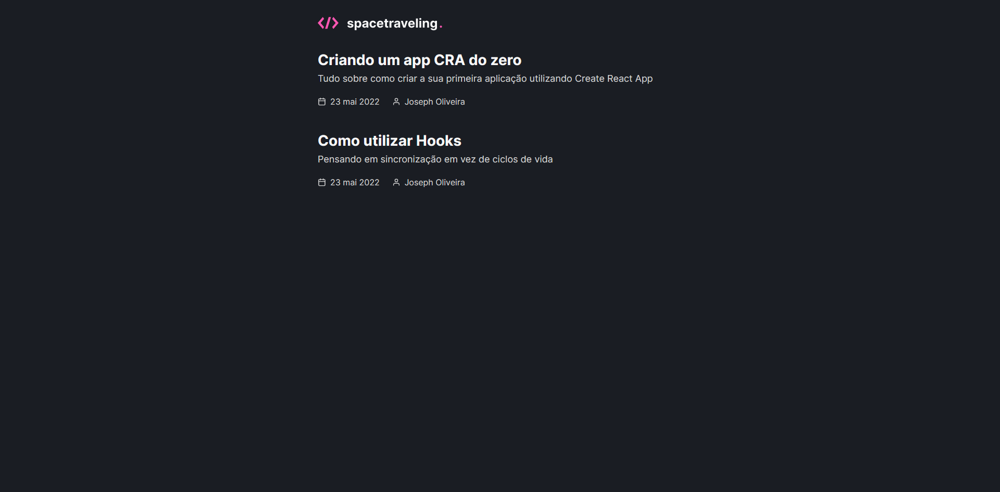
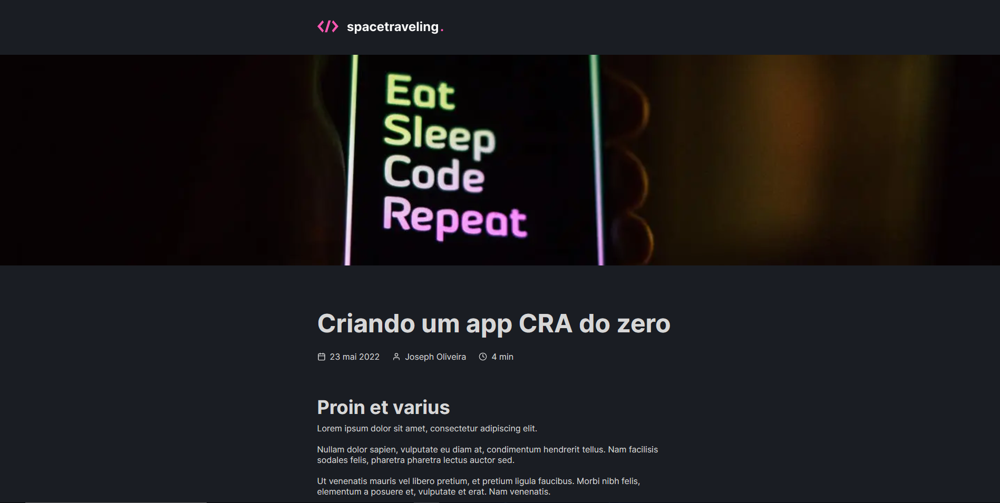

# Spacetraveling

This project is a challenge created on [Ignite Bootcamp](rocketseat.com.br/ignite).

## Some Images

## Goals of challenge

- Stylization with Sass;
- Import fonts from Google;
- Consume posts from Prismic CMS;
- Posts pagination;
- Calculate estimated time to reading post;
- Generate static page with methods `getStaticProps` and `getStaticPaths` in NextJS;
- Format datewith `date-fns`;
- Usage icons with `react-icons`;
- HTTP Request using `fetch`;
- And Others.
